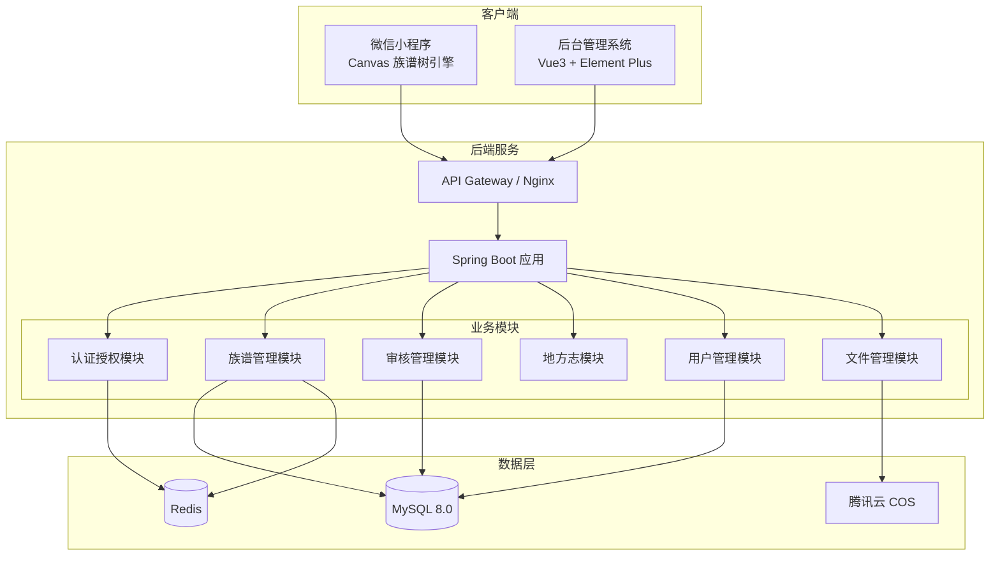
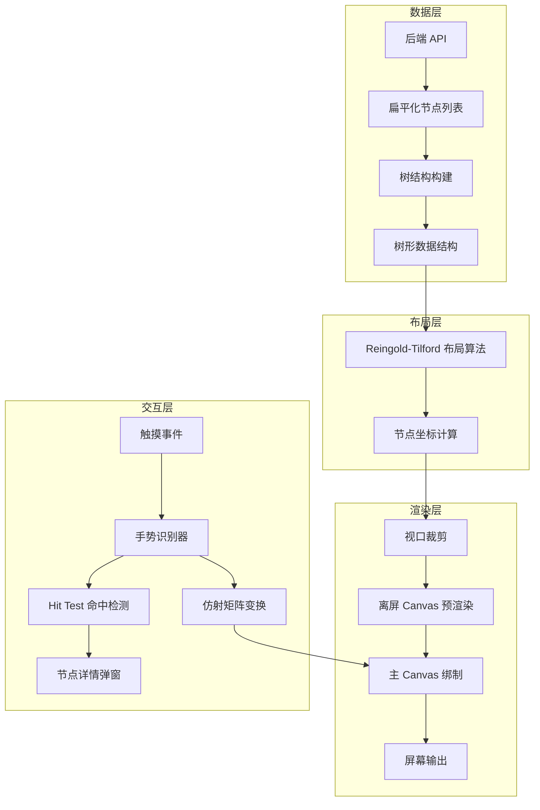
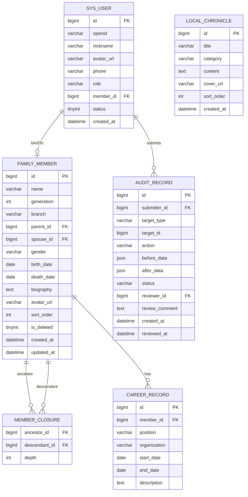

## 产品概述

家族族谱数字化管理平台，包含微信小程序端、Spring Boot 后端服务、Vue3 后台管理系统三大子系统。核心亮点为基于 Canvas 2D 的高性能族谱树渲染引擎，支持千级节点流畅交互。

## 核心功能

### 微信小程序端

- Canvas 2D 族谱树引擎：树形布局渲染、拖拽平移、双指缩放、点击节点查看详情、世代折叠/展开、横竖布局切换、搜索定位动画、长图导出
- 族谱查询：按姓名、辈分、世代、房支检索，搜索结果定位到族谱树节点
- 人物详情：基本信息、生平简介、照片、任职经历展示
- 地方志：家族地理、历史、风俗、祠堂等文献资料浏览
- 数据提交：普通用户提交新增/修改申请，进入审核流程
- 消息通知：审核结果通知、族谱更新提醒
- 个人中心：身份认证、提交记录、收藏

### Spring Boot 后端服务

- 族谱数据 CRUD：世系结构的增删改查，扁平化节点列表接口
- 用户角色权限：超级管理员、管理员、普通用户、访客四级权限
- 审核机制：提交 → 待审核 → 通过/驳回，审核日志记录
- 数据导入导出：Excel/CSV 批量导入，Gedcom 格式导入导出，PDF 导出
- 文件存储：图片、附件上传与管理

### Vue3 后台管理系统

- 族谱管理：世系结构可视化编辑，人物信息管理
- 审核中心：待审核列表、通过/驳回操作、批量审核
- 数据导入导出：Excel/CSV/Gedcom 格式支持
- 地方志管理：条目增删改查、图文附件上传
- 任职信息管理：职务、任期、机构维护
- 用户管理：注册审核、角色分配、权限设置
- 系统设置：家族名称、堂号、字辈规则、辈分配置
- 操作日志：所有增删改操作的审计追踪

## 技术栈

| 层级 | 技术选型 |
| --- | --- |
| 前端小程序 | 微信小程序原生（WXML/WXSS/JS） |
| 族谱树引擎 | 自研 Canvas 2D 渲染引擎 |
| 后台管理 | Vue3 + TypeScript + Element Plus + Vite |
| 后端服务 | Java 17 + Spring Boot 3.x + MyBatis-Plus |
| 数据库 | MySQL 8.0 |
| 缓存 | Redis（会话管理、热点数据缓存） |
| 文件存储 | 腾讯云 COS |
| 构建部署 | Maven + Docker |
| API 文档 | Swagger/SpringDoc |


## 实现方案

### 整体策略

采用前后端分离架构，后端提供 RESTful API，三端（小程序、后台管理、移动端）共用同一套后端服务。按照用户建议的四期开发计划，一期聚焦后端核心数据结构与审核流程，二期开发 Canvas 族谱树引擎。

### 关键技术决策

**1. 族谱树数据存储 — 邻接表 + 闭包表混合方案**

- 主表使用邻接表（parent_id）存储直接父子关系，简单直观
- 辅助闭包表（ancestor_id, descendant_id, depth）支持高效的祖先链查询和后代查询
- 理由：MySQL 8.0 支持 CTE 递归查询，但闭包表在频繁的子树查询场景下性能更优（O(1) 查询 vs O(depth) 递归），族谱场景中"查看某人所有后代"是高频操作

**2. Canvas 族谱树引擎 — 分层架构**

- 数据层：后端返回扁平化节点数组，前端构建树结构
- 布局层：实现 Reingold-Tilford 紧凑树布局算法，自动避免节点重叠
- 渲染层：Canvas 2D 绑定 `<canvas type="2d">`，视口裁剪只绘制可见区域
- 交互层：自研手势识别器（拖拽/缩放/点击），基于仿射矩阵变换实现视口操作
- 缓存层：离屏 Canvas 预渲染复杂节点卡片，主画布贴图

**3. 审核机制 — 状态机模式**

- 数据提交状态：DRAFT → PENDING → APPROVED / REJECTED
- 审核通过后触发数据合并到正式表，前端增量更新
- 审核日志独立存储，支持审计追踪

**4. 权限设计 — RBAC 模型**

- 基于角色的访问控制，Spring Security + JWT 实现
- 四级角色：SUPER_ADMIN、ADMIN、MEMBER、GUEST
- 接口级别权限注解控制

### 性能考量

- Canvas 族谱树：视口裁剪确保只渲染可见节点（万级节点场景下渲染节点数控制在 50-200 个）
- Hit Test：空间索引（网格划分），触摸事件 O(1) 定位节点
- 后端分页：族谱节点按需加载，支持子树懒加载
- Redis 缓存：族谱树结构数据缓存，审核通过后失效重建
- 数据库索引：闭包表联合索引（ancestor_id, depth）、（descendant_id, depth）

## 实现注意事项

- Canvas 2D 必须使用新版接口 `<canvas type="2d">`，通过 `wx.createSelectorQuery().select('#canvas').node()` 获取节点
- 高清屏适配：获取 `wx.getSystemInfoSync().pixelRatio`，设置 canvas 实际尺寸为显示尺寸 * pixelRatio
- 手势处理使用 `bindtouchstart/bindtouchmove/bindtouchend`，需自行实现多点触控识别
- Spring Boot 接口统一返回格式 `{code, message, data}`，统一异常处理
- MyBatis-Plus 逻辑删除（is_deleted 字段），族谱数据不做物理删除
- 文件上传先传 COS 获取 URL，再关联到业务数据

## 架构设计

### 系统架构图



### Canvas 族谱树引擎架构



### 数据库 ER 关系（核心表）



## 目录结构

本项目为 Monorepo 结构，包含三个子项目：后端服务、微信小程序、后台管理系统。

```
族谱/
├── README.md                          # [NEW] 项目总览文档，包含架构说明、开发指南、部署说明
├── docs/                              # [NEW] 项目文档目录
│   ├── api.md                         # [NEW] API 接口文档
│   ├── database.md                    # [NEW] 数据库设计文档
│   └── deployment.md                  # [NEW] 部署文档
│
├── server/                            # [NEW] Spring Boot 后端服务
│   ├── pom.xml                        # [NEW] Maven 项目配置，定义依赖（Spring Boot 3.x, MyBatis-Plus, Redis, JWT, POI, COS SDK）
│   ├── src/main/java/com/family/genealogy/
│   │   ├── GenealogyApplication.java # [NEW] Spring Boot 启动类
│   │   ├── config/                    # [NEW] 配置类目录
│   │   │   ├── SecurityConfig.java    # [NEW] Spring Security 配置，JWT 过滤器、权限规则、CORS 配置
│   │   │   ├── RedisConfig.java       # [NEW] Redis 序列化配置
│   │   │   ├── CosConfig.java         # [NEW] 腾讯云 COS 配置
│   │   │   ├── MyBatisPlusConfig.java # [NEW] MyBatis-Plus 分页插件、逻辑删除配置
│   │   │   └── WebMvcConfig.java      # [NEW] 全局拦截器、统一返回格式配置
│   │   ├── common/                    # [NEW] 公共模块
│   │   │   ├── Result.java            # [NEW] 统一响应封装类 {code, message, data}
│   │   │   ├── PageResult.java        # [NEW] 分页响应封装
│   │   │   ├── BusinessException.java # [NEW] 业务异常类
│   │   │   ├── GlobalExceptionHandler.java # [NEW] 全局异常处理器
│   │   │   └── Constants.java         # [NEW] 系统常量定义
│   │   ├── entity/                    # [NEW] 实体类目录
│   │   │   ├── FamilyMember.java      # [NEW] 族谱成员实体，含基本信息、世代、房支、父节点引用
│   │   │   ├── MemberClosure.java     # [NEW] 闭包表实体，存储祖先-后代关系及深度
│   │   │   ├── AuditRecord.java       # [NEW] 审核记录实体，含提交人、目标、状态、审核意见
│   │   │   ├── SysUser.java           # [NEW] 系统用户实体，含 openid、角色、绑定成员
│   │   │   ├── LocalChronicle.java    # [NEW] 地方志实体
│   │   │   ├── CareerRecord.java      # [NEW] 任职履历实体
│   │   │   └── OperationLog.java      # [NEW] 操作日志实体
│   │   ├── mapper/                    # [NEW] MyBatis Mapper 接口目录
│   │   │   ├── FamilyMemberMapper.java
│   │   │   ├── MemberClosureMapper.java
│   │   │   ├── AuditRecordMapper.java
│   │   │   ├── SysUserMapper.java
│   │   │   ├── LocalChronicleMapper.java
│   │   │   └── CareerRecordMapper.java
│   │   ├── service/                   # [NEW] 业务逻辑层
│   │   │   ├── FamilyMemberService.java    # [NEW] 族谱成员服务：CRUD、树结构查询、子树加载、闭包表维护
│   │   │   ├── AuditService.java           # [NEW] 审核服务：提交审核、审批、驳回、状态流转、数据合并
│   │   │   ├── AuthService.java            # [NEW] 认证服务：微信登录、JWT 签发、权限校验
│   │   │   ├── LocalChronicleService.java  # [NEW] 地方志服务
│   │   │   ├── CareerRecordService.java    # [NEW] 任职履历服务
│   │   │   ├── FileService.java            # [NEW] 文件上传服务：COS 上传、URL 生成
│   │   │   ├── ImportExportService.java    # [NEW] 导入导出服务：Excel/CSV/Gedcom 解析与生成
│   │   │   └── UserService.java            # [NEW] 用户管理服务
│   │   ├── controller/                # [NEW] 控制器层
│   │   │   ├── AuthController.java    # [NEW] 认证接口：微信登录、token 刷新
│   │   │   ├── FamilyMemberController.java # [NEW] 族谱成员接口：树结构查询、节点CRUD、搜索
│   │   │   ├── AuditController.java   # [NEW] 审核接口：提交、审批列表、通过/驳回
│   │   │   ├── LocalChronicleController.java # [NEW] 地方志接口
│   │   │   ├── CareerRecordController.java # [NEW] 任职履历接口
│   │   │   ├── FileController.java    # [NEW] 文件上传接口
│   │   │   ├── ImportExportController.java # [NEW] 导入导出接口
│   │   │   ├── UserController.java    # [NEW] 用户管理接口
│   │   │   └── SystemController.java  # [NEW] 系统设置接口
│   │   ├── security/                  # [NEW] 安全模块
│   │   │   ├── JwtTokenProvider.java  # [NEW] JWT 令牌生成与验证
│   │   │   ├── JwtAuthFilter.java     # [NEW] JWT 认证过滤器
│   │   │   └── UserDetailsServiceImpl.java # [NEW] 用户详情加载实现
│   │   └── util/                      # [NEW] 工具类
│   │       ├── GedcomParser.java      # [NEW] Gedcom 格式解析器
│   │       └── ExcelUtil.java         # [NEW] Excel 导入导出工具
│   ├── src/main/resources/
│   │   ├── application.yml            # [NEW] 主配置文件：数据源、Redis、COS、JWT 密钥
│   │   ├── application-dev.yml        # [NEW] 开发环境配置
│   │   ├── application-prod.yml       # [NEW] 生产环境配置
│   │   └── mapper/                    # [NEW] MyBatis XML 映射文件
│   │       ├── FamilyMemberMapper.xml # [NEW] 复杂 SQL：树查询、闭包表操作
│   │       └── MemberClosureMapper.xml # [NEW] 闭包表批量插入、子树查询
│   └── sql/
│       └── init.sql                   # [NEW] 数据库初始化脚本：建表、索引、初始数据
│
├── miniprogram/                       # [NEW] 微信小程序
│   ├── project.config.json            # [NEW] 小程序项目配置
│   ├── app.js                         # [NEW] 小程序入口：全局状态、登录逻辑
│   ├── app.json                       # [NEW] 全局配置：页面路由、tabBar、权限声明
│   ├── app.wxss                       # [NEW] 全局样式
│   ├── utils/                         # [NEW] 工具模块
│   │   ├── request.js                 # [NEW] 网络请求封装：baseURL、token 注入、错误处理
│   │   ├── auth.js                    # [NEW] 登录态管理：微信登录、token 存储刷新
│   │   └── util.js                    # [NEW] 通用工具函数
│   ├── canvas-engine/                 # [NEW] Canvas 族谱树引擎（核心模块）
│   │   ├── index.js                   # [NEW] 引擎入口：初始化、对外 API 暴露
│   │   ├── tree-builder.js            # [NEW] 树结构构建：扁平数据转树、节点索引构建
│   │   ├── layout.js                  # [NEW] 布局算法：Reingold-Tilford 紧凑树布局，计算每个节点 x/y 坐标
│   │   ├── renderer.js                # [NEW] 渲染器：Canvas 2D 绑制逻辑、节点卡片绘制、连线绘制、视口裁剪
│   │   ├── viewport.js                # [NEW] 视口管理：仿射矩阵变换、缩放/平移状态、坐标转换
│   │   ├── gesture.js                 # [NEW] 手势识别器：拖拽、双指缩放、点击、长按识别
│   │   ├── hit-test.js                # [NEW] 命中检测：网格空间索引、触摸点到节点的映射
│   │   ├── animation.js               # [NEW] 动画系统：平滑过渡、搜索定位动画、展开/折叠动画
│   │   └── offscreen.js               # [NEW] 离屏渲染：节点卡片预渲染缓存、头像图片管理
│   ├── pages/                         # [NEW] 页面目录
│   │   ├── index/                     # [NEW] 首页：族谱概览、快捷入口
│   │   ├── tree/                      # [NEW] 族谱树页面：Canvas 全屏渲染、工具栏
│   │   ├── search/                    # [NEW] 搜索页面：多条件检索、结果列表
│   │   ├── member-detail/             # [NEW] 人物详情页：基本信息、生平、照片、履历
│   │   ├── chronicle/                 # [NEW] 地方志列表与详情
│   │   ├── submit/                    # [NEW] 数据提交页：新增/修改人物表单
│   │   ├── message/                   # [NEW] 消息通知页
│   │   └── profile/                   # [NEW] 个人中心：身份信息、提交记录
│   └── components/                    # [NEW] 公共组件
│       ├── member-card/               # [NEW] 人物卡片组件
│       ├── tree-toolbar/              # [NEW] 族谱树工具栏（缩放、定位、布局切换）
│       └── empty-state/               # [NEW] 空状态占位组件
│
├── admin/                             # [NEW] Vue3 后台管理系统
│   ├── package.json                   # [NEW] 依赖配置：Vue3、Element Plus、Vite、Axios、ECharts
│   ├── vite.config.ts                 # [NEW] Vite 构建配置：代理、别名、按需导入
│   ├── tsconfig.json                  # [NEW] TypeScript 配置
│   ├── src/
│   │   ├── main.ts                    # [NEW] 应用入口：Vue 实例、全局插件注册
│   │   ├── App.vue                    # [NEW] 根组件
│   │   ├── router/index.ts            # [NEW] 路由配置：页面路由、权限守卫、动态路由
│   │   ├── store/                     # [NEW] Pinia 状态管理
│   │   │   ├── user.ts                # [NEW] 用户状态：登录信息、权限、token
│   │   │   └── app.ts                 # [NEW] 应用状态：侧边栏、主题
│   │   ├── api/                       # [NEW] API 接口定义
│   │   │   ├── request.ts             # [NEW] Axios 封装：拦截器、token 注入、错误处理
│   │   │   ├── member.ts              # [NEW] 族谱成员 API
│   │   │   ├── audit.ts               # [NEW] 审核 API
│   │   │   ├── chronicle.ts           # [NEW] 地方志 API
│   │   │   ├── user.ts                # [NEW] 用户管理 API
│   │   │   └── system.ts              # [NEW] 系统设置 API
│   │   ├── views/                     # [NEW] 页面视图
│   │   │   ├── login/LoginView.vue    # [NEW] 登录页
│   │   │   ├── dashboard/DashboardView.vue # [NEW] 仪表盘：数据统计概览
│   │   │   ├── member/                # [NEW] 族谱管理：成员列表、树形编辑、详情编辑
│   │   │   ├── audit/AuditView.vue    # [NEW] 审核中心：待审核列表、审批操作
│   │   │   ├── chronicle/             # [NEW] 地方志管理：列表、编辑
│   │   │   ├── career/                # [NEW] 任职管理
│   │   │   ├── user/UserView.vue      # [NEW] 用户管理：列表、角色分配
│   │   │   ├── import-export/         # [NEW] 导入导出页面
│   │   │   ├── system/                # [NEW] 系统设置：基本配置、字辈管理
│   │   │   └── log/LogView.vue        # [NEW] 操作日志
│   │   ├── components/                # [NEW] 公共组件
│   │   │   ├── layout/                # [NEW] 布局组件：侧边栏、顶栏、面包屑
│   │   │   └── common/                # [NEW] 通用组件：表格、表单、上传
│   │   ├── styles/                    # [NEW] 全局样式
│   │   │   └── index.scss             # [NEW] 全局样式变量、重置样式
│   │   └── utils/                     # [NEW] 工具函数
│   │       ├── auth.ts                # [NEW] token 管理
│   │       └── index.ts               # [NEW] 通用工具
│   └── index.html                     # [NEW] HTML 入口
```

## 关键代码结构

### 族谱树节点数据接口

```typescript
// 后端返回的扁平化节点结构
interface FamilyMemberNode {
  id: number;
  name: string;
  gender: 'M' | 'F';
  generation: number;      // 世代
  branch: string;          // 房支
  parentId: number | null;
  spouseId: number | null;
  birthDate: string;
  deathDate: string | null;
  avatarUrl: string | null;
  childrenCount: number;   // 子节点数量（用于懒加载判断）
}

// Canvas 引擎内部布局节点
interface LayoutNode {
  data: FamilyMemberNode;
  x: number;               // 布局计算后的 x 坐标
  y: number;               // 布局计算后的 y 坐标
  width: number;           // 节点卡片宽度
  height: number;          // 节点卡片高度
  collapsed: boolean;      // 是否折叠子树
  children: LayoutNode[];
  parent: LayoutNode | null;
}

// 视口状态
interface ViewportState {
  offsetX: number;         // 平移偏移 X
  offsetY: number;         // 平移偏移 Y
  scale: number;           // 缩放比例
  minScale: number;
  maxScale: number;
}
```

### 审核状态机

```java
// 审核状态枚举
public enum AuditStatus {
    DRAFT,      // 草稿
    PENDING,    // 待审核
    APPROVED,   // 已通过
    REJECTED    // 已驳回
}

// 审核动作枚举
public enum AuditAction {
    CREATE,     // 新增成员
    UPDATE,     // 修改信息
    DELETE      // 删除成员
}
```

## 设计风格

采用中国传统文化与现代简约设计融合的风格，体现家族文化的庄重感与数字化产品的易用性。整体以暖色调为主，搭配中式纹理元素点缀，营造温馨典雅的氛围。

## 页面规划

### 页面一：首页（族谱概览）

- 顶部导航栏：家族名称 + 堂号展示，右侧消息图标带红点提醒
- 家族概览卡片区：总人数、世代数、房支数统计，采用圆角卡片 + 渐变背景
- 快捷功能入口：族谱树、搜索、地方志、提交数据，2x2 网格图标布局
- 最近更新动态：时间线样式展示最近审核通过的变更记录
- 底部 TabBar：首页、族谱树、搜索、个人中心

### 页面二：族谱树（Canvas 全屏）

- 顶部悬浮工具栏：返回按钮、搜索入口、布局切换（横/竖）、全屏预览
- Canvas 全屏渲染区：占据除工具栏外全部空间，深色背景衬托节点卡片
- 节点卡片设计：圆角矩形，顶部头像圆形裁剪，下方姓名 + 辈分文字，男性蓝色边框女性粉色边框
- 连线样式：贝塞尔曲线连接，浅金色线条，线宽随缩放自适应
- 右下角浮动按钮组：放大、缩小、回到根节点、导出长图
- 底部信息条：当前缩放比例、当前聚焦世代

### 页面三：人物详情

- 顶部大图区：人物头像居中，背景模糊渐变，姓名 + 辈分 + 世代标签
- 基本信息卡片：出生日期、性别、房支、配偶信息，列表式排布
- 生平简介区：富文本展示，支持图文混排
- 任职履历时间线：纵向时间线，每项含职务、机构、任期
- 家族关系区：父母、配偶、子女快捷跳转链接
- 底部操作栏：提交修改、收藏、分享

### 页面四：搜索页

- 顶部搜索栏：输入框 + 语音搜索图标，支持实时联想
- 筛选条件栏：世代下拉、房支下拉、性别筛选，横向滚动标签
- 搜索结果列表：人物卡片式展示，头像 + 姓名 + 世代 + 房支，点击可跳转详情或定位到族谱树
- 空状态：无结果时展示引导插图

### 页面五：个人中心

- 顶部用户信息区：微信头像、昵称、角色标签（管理员/成员）、绑定的族谱身份
- 功能列表：我的提交（待审核/已通过/已驳回）、我的收藏、消息通知、身份认证
- 设置区：关于家族、使用帮助、意见反馈

## 交互设计

- 族谱树拖拽时节点跟随手指平滑移动，松手后有惯性滑动效果
- 双指缩放带弹性边界，超出范围后回弹
- 点击节点时节点放大高亮，弹出简要信息气泡，再次点击进入详情
- 搜索定位时画面平滑动画飞行到目标节点，目标节点闪烁高亮
- 页面切换使用微信原生转场动画，保持流畅感

## Agent Extensions

### SubAgent

- **code-explorer**
- Purpose: 在后续开发过程中探索已创建的代码结构，确保模块间依赖关系正确，验证接口一致性
- Expected outcome: 快速定位代码位置、验证接口契约、确认模块间调用关系